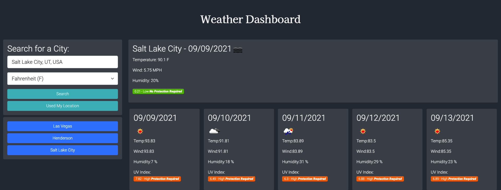

# Weather Dashboard

## Purpose

Using Open Weather API create a Weather Dashboard, when you select a city get the current weather and the 5 days forecast.

## Built With

- Javascript
- HTML & CSS
- Bootstrap 5
- localStorages
- Open Weather API
- Google Place API
- Momentjs

## Website

https://joseduardo15062005.github.io/weather/

## Contribution

Made with ❤️ by [joseduardo]
